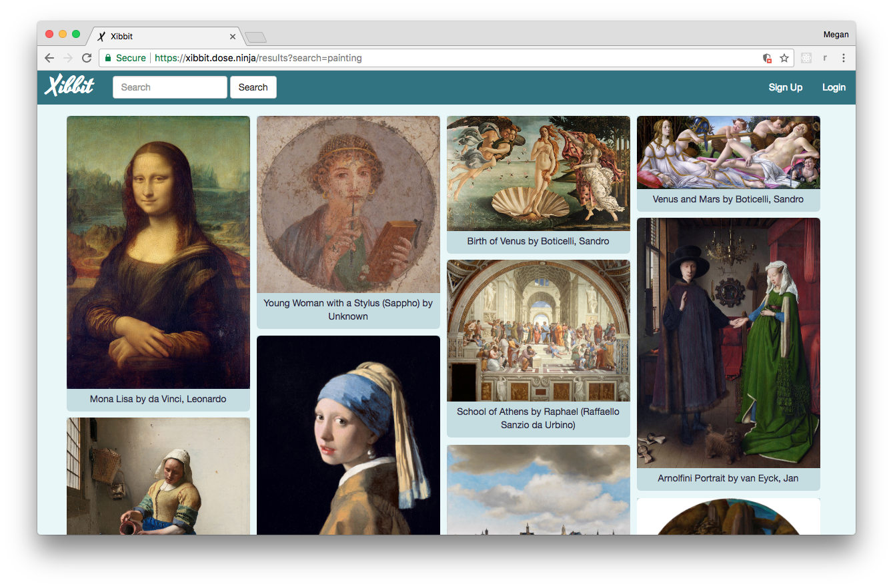
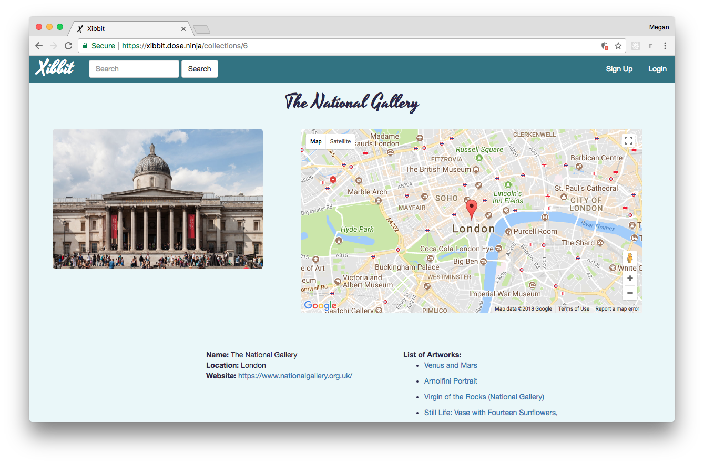
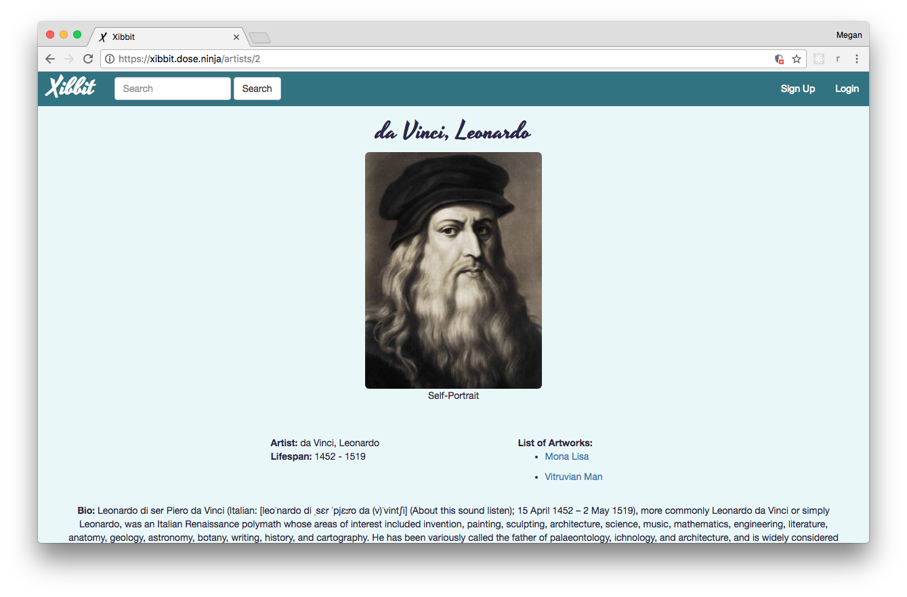

# Xibbit

This application is a tool for learning about some of the most famous masterpieces of Art History. It allows you to search a database (similar to IMDB for movies); create an account; and save your favorite art, artists, and museums to your user profile.
Whether you are a student, teacher, or traveler, your profile will also map out where the art lives in the world, telling you which cities and art collections to visit to see the art in person.

## Demo Video

https://youtu.be/50nIywibidM

## Online Demo

https://xibbit.dose.ninja/

## Screenshots

## Tech stack

* Python
* Javascript (including jQuery, AJAX)
* Jinja
* Flask
* SQLAlchemy
* Bootstrap
* [Masonry](https://github.com/desandro/masonry
  )
* Google Maps API
* Google Cloud Vision API

## Getting Started

After cloning or forking this repo, perform the following steps:

1. Install and activate a virtual environment
1. `pip install -r requirements.txt`
1. Create local postgres database
1. Sign-up for Google Cloud Vision API access, get your credentials in JSON format,
and put the file in `secrets/VisionAPIcredentials.json`
1. Seed db using `bash seed.sh`
1. Run `DATABASE_URL=postgres://user@host/db python server.py`
1. Navigate to http://localhost:5000/
